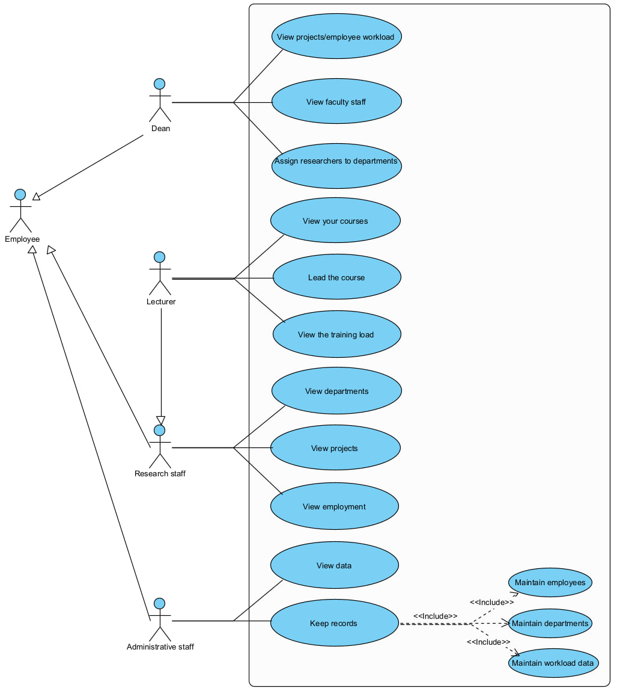

# Университетская информационная система  
Лабораторная работа №10 (UML моделирование)

## Описание проекта
Данная лабораторная работа представляет UML-модель и программную реализацию  
**университетской информационной системы**.  

Основная цель — построить согласованный набор UML-диаграмм и реализовать код,  
моделирующий научно-педагогический состав университета.

# Use Case Diagram  
**Отражает функциональные требования к единой системе “Университетская информационная система”**  

# Class Diagram  
Диаграмма классов построена по тексту задания:  
- University → Faculty → Institute (композиция)  
- Employee → ResearchStaff / AdministrativeStaff / Dean / Lecturer (обобщение)  
- ResearchStaff —(Participation)— Project (association class с hours)  
- Lecturer → ведёт Course  

#Sequence Diagram
**Диаграмма последовательности для прецедента использования  
«Назначить исследователя на кафедру» (Assign researchers to departments)**  

Данная диаграмма отражает поведение системы в рамках одного из ключевых прецедентов Use Case Diagram.  
Актор — декан факультета — инициирует назначение научного сотрудника на кафедру.  
Все объекты диаграммы являются экземплярами классов, представленных на Class Diagram.

## Логика взаимодействия:

1. **Декан** выбирает сотрудника и кафедру, после чего инициирует сценарий  
   `assignResearcherToInstitute(deanId, researcherId, instituteId)`.

2. Объект **University**:
   - определяет факультет, которым управляет декан (`getFacultyByDean`);
   - находит выбранного научного сотрудника (`findResearcher`);
   - извлекает выбранную кафедру (`findInstitute`).

3. Система проверяет:
   - принадлежит ли выбранная кафедра факультету декана  
     (`Faculty.containsInstitute`).  
   Если кафедра не относится к факультету — возвращается ошибка.

4. При успешной проверке:
   - кафедра получает сотрудника (`Institute.addResearchStaff`);
   - сотрудник синхронно обновляет свою связь с кафедрой  
     (`ResearchStaff.addInstitute`).

5. **University** формирует подтверждение об успешном назначении  
   и возвращает его декану.

## Диаграмма:

